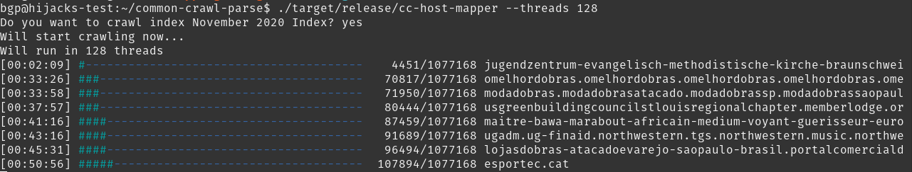

# CommonCrawl Host-IP Mapper

CommonCrawl Host Mapper crawls the select CommonCrawl index and generate host to
IP mapping file.

It is designed to be massively parallelizable. Depending on the capacity of the
runtime system, user can run the crawling on tens or hundreds of threads to
speed up the retrival process.

It also comes with very straightforward commandline user interface and progress
bar on the current crawling process.


## Build

``` sh
cargo build --release
```

## Examples

It defaults to crawl the most-recent available CommonCrawl index, and outputting
the results to the current directory with filename to be
`mapping-INDEX_ID.csv.gz`. The CommonCrawl's available indices can be found at
https://index.commoncrawl.org/collinfo.json.

To run with 128 threads:

``` sh
./target/release/cc-host-mapper --threads 128
```



To output to a different file:
``` sh
./target/release/cc-host-mapper --threads 128 --output custom-output-file-name.csv
```

## Output

The output of the file is formatted as `HOST,DATE,IP`.

``` csv
...
college.ac,2020-11-25,172.104.36.121
college.ac,2020-11-28,172.104.36.121
door.ac,2020-11-26,54.95.55.40
door.ac,2020-11-24,54.95.55.40
door.ac,2020-11-23,54.95.55.40
door.ac,2020-12-01,54.168.46.54
...
```
